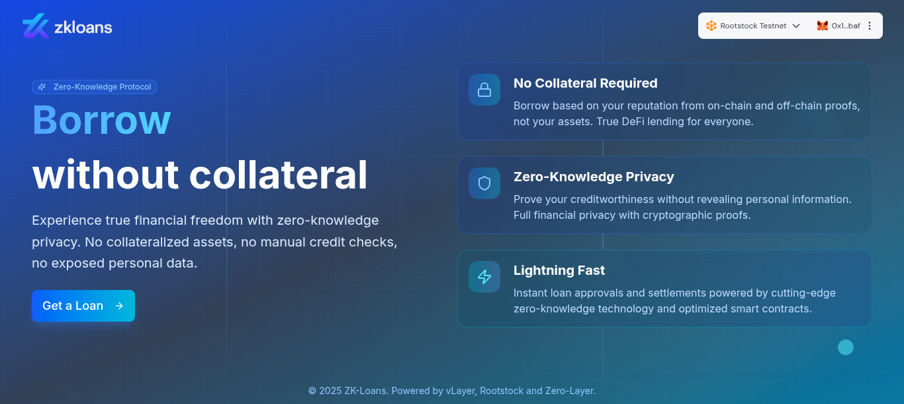

<p align="center">
  
</p>

<h1 align="center">ZK-Loans</h1>

<p align="center">
    A protocol for <strong>uncollateralized lending</strong>, harnessing cross-chain reputation backed by <strong>zk proofs</strong>.
    <br />
    Powered by
    <a href="https://www.vlayer.xyz/" target="_blank" rel="noopener noreferrer">vLayer</a>,
    <a href="https://rootstock.io/" target="_blank" rel="noopener noreferrer">Rootstock</a> & 
    <a href="https://layerzero.network/" target="_blank" rel="noopener noreferrer">Zero-Layer</a>
</p>

---

## 📖 Description

ZK Loans is a decentralized protocol that enables users to access collateral-free loans on Rootstock by leveraging a unique combination of on-chain and off-chain zero-knowledge proofs.

The process begins by verifying off-chain financial data, such as extracting verifiable bank summaries directly from the user’s email inbox. This is complemented by on-chain proofs, including time travel proofs (which assess historical wallet balances over specific block ranges) and teleport proofs (which evaluate liquidity across multiple blockchain networks).

Once solvency is established, the user undergoes KYC verification to confirm their identity. All proof components — both on-chain and off-chain — are aggregated to build a cross-chain reputation score. This reputation is relayed using LayerZero to a smart contract on Ethereum Sepolia, which handles creditworthiness assessment and validation.

Finally, a smart contract on Rootstock executes the disbursement of the approved RBTC loan amount. To ensure legal compliance and auditability, an on-chain attestation is generated that records the hash and signature of the signed legal agreement, while the full document is securely stored off-chain for future reference.

---

## 🧪 How to Test the Integration

#### 1️⃣ Setup environment variables

These are additional variables **not** included in `.env.example` on the frontend:

```bash
NEXT_PUBLIC_OPENAI_API_KEY=
NEXT_PUBLIC_GOOGLE_CLIENT_ID=
NEXT_PUBLIC_GOOGLE_CLIENT_SECRET=
NEXT_PUBLIC_VLAYER_API_TOKEN=
```

---

#### 2️⃣ Backend setup (NestJS)

```bash
cd backend
yarn install
yarn start:dev
```

---

#### 3️⃣ Frontend setup (Next.js)

```bash
cd frontend
cp .env.example .env
yarn install
yarn dev
```

🎉 Once both servers are running, open [http://localhost:3000](http://localhost:3000) in your browser.  
You should see ZK-Loans live!

---


## 🔗 Rootstock Integration

We deployed smart contracts on Rootstock to handle loan disbursement, verify user attestations, and manage on-chain RBTC transfers. The system ensures at least two on-chain testnet transactions, meeting qualification requirements.

**Rootstock Lending Contract Address:**  
`0x31e0A37bda916C0098be8600e6f156D877cb4BA8`

The contract is located in the `vlayer` directory.


---

## ⚙️ VLayer Integration

We use VLayer’s Email Proofs to extract and validate bank summaries off-chain, as well as Time Travel and Teleport proofs to validate on-chain liquidity across multiple chains. Both Prover and Verifier contracts are incorporated and linked.

| Proof Type     | Prover Address                                     | Verifier Address                                   |
|---------------|----------------------------------------------------|---------------------------------------------------|
| Time Travel   | `0x51fb4ab6b17bd7f5a18f031369da638ce7b19e30`       | `0x967e74ef3572ea6f8ae0bc3309227945613ad239`      |
| Teleporter    | `0x438cb7d7e09a3cf573315d74afacecc53266d713`       | `0x9ad75d90e0bdb6089fbf849e722367fd5068d915`      |
| Email Proof   | `0x9134a21cb76745cf03e110be834b83e651b39904`       | `0xc647ec40d2937dbf9e3ff8486dd7531af6faa3f4`      |


These contracts are organized in separate subfolders within the `vlayer-contracts` directory.

---

## 🌉 LayerZero Integration

We implemented LayerZero’s omnichain messaging (OApp) to transmit proof data and cross-chain reputation to the Base Sepolia smart contract. This leverages horizontal composability by triggering follow-up messages on Rootstock after reputation validation.

**Contracts:**  
- Rootstock Lending: `0x31e0A37bda916C0098be8600e6f156D877cb4BA8`  
- Ethereum Sepolia Scoring: `0xFbC66bD8466f7B7628fD32F8a8C07f3976c73979`

---

## 👥 Team

Luciano Leonel Carreño — Full Stack Developer and Lawyer

With 4 years of experience as a full stack developer and Rust engineer, Luciano is passionate about privacy, zk proofs, and has worked with Verifiable Credentials as well as Bitcoin Core in Rust.

Fabian Edwin Diaz Viera — Blockchain Developer

With 3 years of experience as a developer, Fabian specializes in Blockchain and has worked on Solana-based projects.

Together, we have participated in multiple hackathons, combining our technical skills to build innovative solutions focused on blockchain, privacy, and zero-knowledge proofs.

---

## 🎥 Video Demo or Slide Deck

_Link to your demo video or slide deck here._
